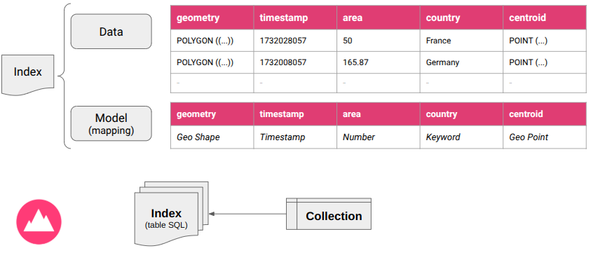

# Ingest data

The `ARLAS CLI` allows you to ingest data into ARLAS and make it accessible through ARLAS Dashboards.

Ingest Data in ARLAS

## ARLAS Data structure

To be explored in ARLAS dashboards, the data has to be indexed in an [Elasticsearch](concepts.md#elasticsearch) (ES) [index](concepts.md#es-index).

An index contains the data and a model ([mapping](concepts.md#es-mapping)) to describe how fields have to be interpreted (types).

ARLAS [collections](concepts.md#arlas-collection) are built on top of indices. 
They describe the basic data structure for its visualization and elements needed for the data access policy.

Data indices and collections in ARLAS

## Ingest with ARLAS CLI

Once you have installed ARLAS CLI (see [Installation Guide](install.md)) and configured it with your ARLAS instance (see [Configuration Guide](configuration.md)), you can ingest data using the following commands:

- **Create an Index with a Mapping**: 
- Use [arlas_cli indices mapping](indices.md#mapping) to infer the data model from a data sample and create an empty index.

- **Ingest Data into the Index**:
Use [arlas_cli indices data](indices.md#data) to populate the created index with your data.

- **Create a Collection**:
Use [arlas_cli collections create](collections.md#create) to define a collection based on the index.

To get started with data ingestion using a tutorial sample, check out the [ARLAS CLI Getting Started Guide](started.md#tutorial).

